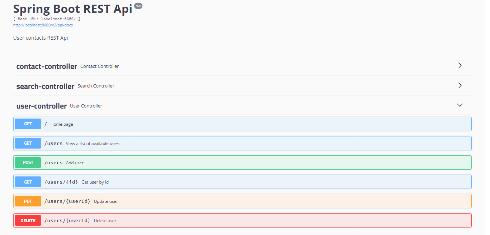

# Spring Boot Rest service
rest-web-service-task

Программа представляет собой серверную часть приложения (без UI части) по работе с пользователями и их телефонной книжкой.
Предоставляет REST API для:

* получения списка всех пользователей (владельцев телефонных книжек);

* создания, получения (по id), удаления, редактирования пользователя;

* создания, получения (по id), удаления, редактирования записи в телефонной книжке;

* получения списка всех записей в телефонной книжке пользователя;

* поиска пользователей по имени (или его части);

* поиска телефонной записи по номеру телефона.

Документация к работе сервиса оформлена с помощью Swagger и доступна во время работы программы по адресу "http://localhost:8080/swagger-ui.html/"

